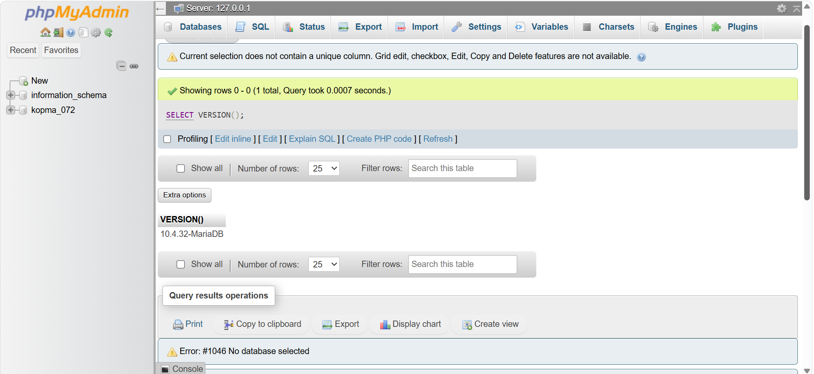
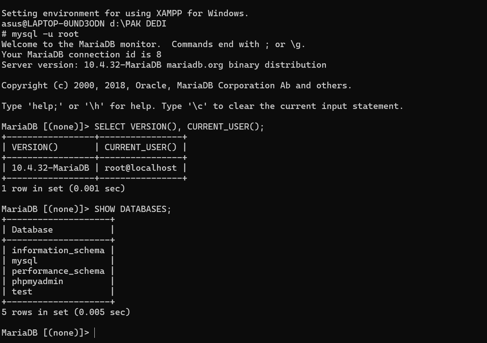
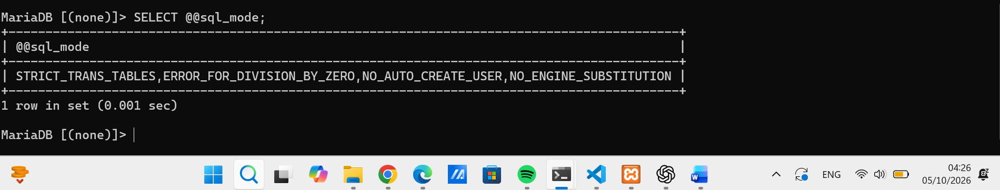
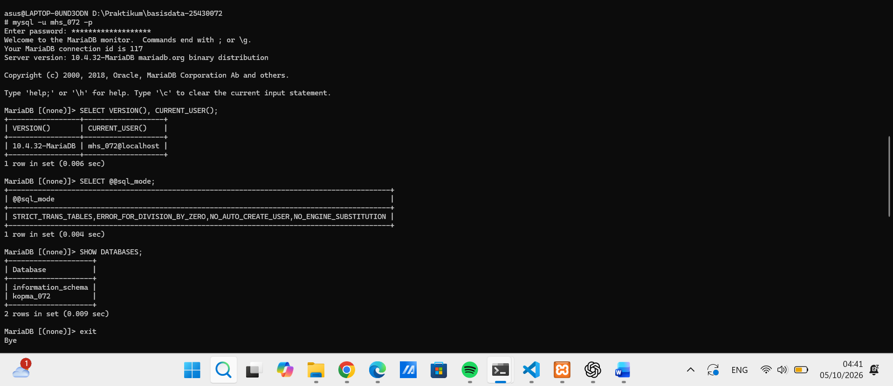
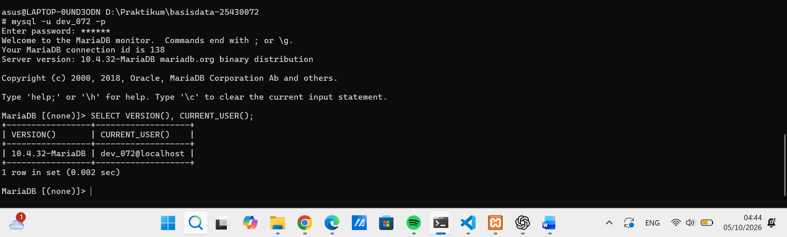
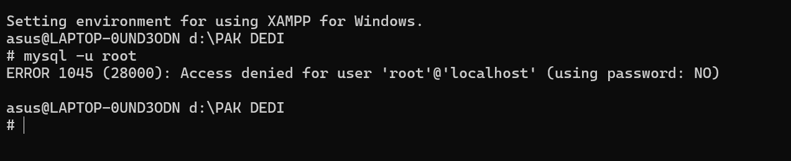
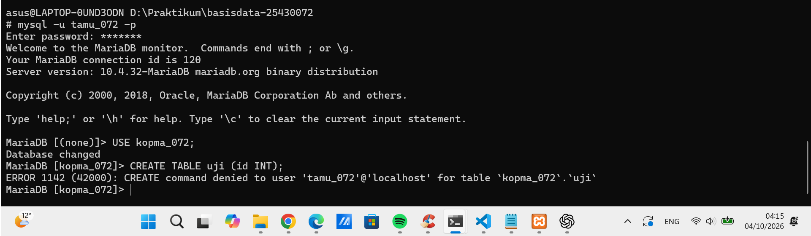
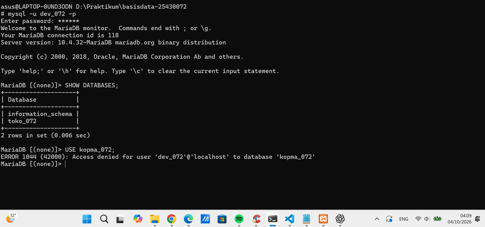
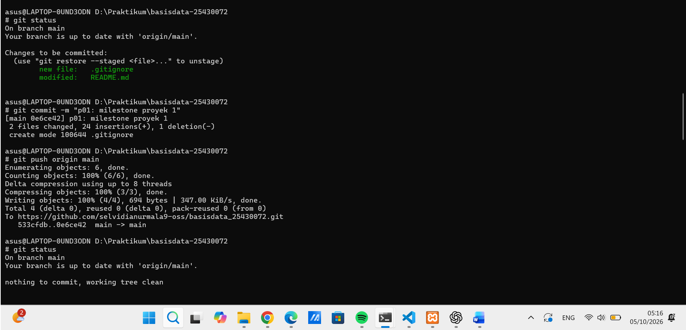

# Laporan Praktikum Basis Data - Pertemuan 1

**Nama:** Selvi Dia Nurmala
**NIM:** 25430072
**Kelas:** C
**Tanggal:** 06/10/2026
**Dosen/Asisten:** Dedi Irawan S.Kom M.T.I

## 1. Tujuan Praktikum
Sesi praktikum 1 merupakan langkah awal untuk menyiapkan lingkungan basis data bagi proyek Toko Online. Dalam sesi ini, dilakukan sejumlah pemeriksaan seperti verifikasi versi MySQL, akun pengguna, mode SQL, basis data yang tersedia, serta hak akses pengguna dan disiapkan sebuah repositori untuk menyimpan hasil pekerjaan yang dibuat selama sesi berlangsung.

## 2. Ringkasan Dasar Teori
MySQL adalah sistem yang digunakan untuk menyimpan dan mengelola data di dalam basis data. Dalam sesi praktik ini, beberapa perintah SQL digunakan untuk memeriksa informasi serta status lingkungan dari instans MySQL yang sedang digunakan.
```sql
SELECT VERSION(), CURRENT_USER();
```
SELECT VERSION() digunakan untuk melihat versi MySQL saat ini, sedangkan CURRENT_USER() mengidentifikasi akun pengguna MySQL yang sedang aktif.
```sql
SELECT @@sql_mode 
```
Digunakan untuk melihat mode SQL yang diterapkan pada server MySQL. Sementara itu, 
```sql
SHOW DATABASES; 
```
Digunakan untuk menampilkan daftar basis data yang dapat diakses atau dilihat oleh pengguna.
Sesi ini juga membahas hak akses pengguna serta kode kesalahan MySQL tertentu yaitu kode 1044, 1045, dan 1142.

## 3. Hasil Langkah Percobaan
### 3.1 Halaman Masuk phpMyAdmin

Gambar 1. Pada langkah pertama, proses masuk ke phpMyAdmin dilakukan menggunakan metode autentikasi berbasis cookie.

### 3.2 Mengecek Versi MySQL dan Pengguna
Perintah berikut digunakan untuk memeriksa versi MySQL yang sedang digunakan serta akun pengguna yang sedang aktif pada sistem.
```sql
SELECT VERSION(), CURRENT_USER();
```
Kemudian, masukkan hasil yang diperoleh dari phpMyAdmin pada bagian di bawah ini.

Gambar 2. Hasil pengecekan versi MySQL dan pengguna.

### 3.3 Mengecek SQL Mode
Perintah berikut digunakan untuk memeriksa mode SQL yang saat ini diterapkan di MySQL.
```sql
SELECT @@sql_mode;
```

Gambar 3. Mode SQL yang saat ini digunakan adalah STRICT_TRANS_TABLES,ERROR_FOR_DIVISION_BY_ZERO,NO_AUTO_CREATE_USER,NO_ENGINE_SUBSTITUTION.
Catat hasil yang ditampilkan oleh phpMyAdmin pada bagian berikut.

### 3.4 Melihat Database
Perintah berikut digunakan untuk menampilkan daftar basis data yang tersedia di MySQL.
```sql
SHOW DATABASES;
```
Hasil:

```sql
SHOW DATABASES; 
```
Menampilkan beberapa basis data yang tersedia: information_schema, mysql, performance_schema, phpmyadmin, dan test.
Catat hasil yang ditampilkan di phpMyAdmin pada bagian di bawah ini.

Basis data yang digunakan dalam latihan praktik ini terdiri dari:

-	`mhs_<3d>`
-	`dev_<3d>`


Gambar 4. Hasil database bagian mhs_<3d>.


Gambar 5. Hasil database bagian dev_<3d>.

### 3.5 Pengujian Galat 1045

Gambar 6. Pengujian ini dilakukan untuk mengetahui perilaku sistem saat proses autentikasi pengguna MySQL gagal.

### 3.6 Pengujian Galat 1142

Gambar 7. Pengujian ini dilakukan untuk mengetahui perilaku sistem ketika pengguna tidak memiliki hak akses untuk menjalankan perintah tertentu.

### 3.7 Pengujian Galat 1044

Gambar 8. Pengujian ini dilakukan untuk mengamati perilaku ketika pengguna tidak memiliki hak akses untuk membuka basis data tertentu.

### 3.8 Git Push Pertama

Gambar 9. Setelah sesi praktik selesai, hasilnya disimpan ke repositori, diikuti dengan push awal.

## 4. Jawaban Titik Analisis

**Analisis 1**

Perintah 
```sql
SELECT VERSION(), CURRENT_USER(); 
```
Digunakan untuk melihat versi server MySQL dan akun pengguna yang sedang aktif.

**Analisis 2**

Perintah 
```sql
SELECT @@sql_mode; 
```
Digunakan untuk melihat pengaturan mode SQL yang saat ini diterapkan pada server MySQL. Pengaturan ini dapat memengaruhi cara MySQL mengeksekusi dan memproses perintah SQL tertentu.

**Analisis 3**

Perintah 
```sql
SHOW DATABASES; 
```
Digunakan untuk melihat daftar basis data yang tersedia bagi pengguna. Basis data yang ditampilkan bergantung pada hak akses yang dimiliki oleh pengguna tersebut.

**Analisis 4**

Hak akses menentukan tindakan yang dapat dilakukan pengguna di dalam basis data. Jika pengguna tidak memiliki izin tertentu, kesalahan akan terjadi saat mencoba mengakses basis data atau menjalankan perintah yang tidak diizinkan.

**Perbedaan Galat 1044, 1045, dan 1142**

| Kode | Arti | Penyebab Umum |
|---|---|---|
| 1044 | Akses ke database ditolak | Pengguna tidak memiliki izin untuk mengakses database tertentu |
| 1045 |	Gagal melakukan login |	Username atau password salah, atau proses autentikasi gagal |
| 1142 |	Perintah tidak diizinkan |	Pengguna tidak memiliki hak akses untuk menjalankan perintah tertentu |


Perbedaan antara ketiga kode kesalahan ini terletak pada sifat masalahnya: 

- kode 1044 menyangkut akses basis data, 
- kode 1045 berkaitan dengan proses masuk (login),
- sedangkan kode 1142 menunjukkan bahwa pengguna tidak memiliki izin untuk menjalankan perintah SQL tertentu.

## 5. Hasil Latihan dan Modifikasi
Dalam sesi praktik ini, lingkungan MySQL diperiksa, basis data yang tersedia dilihat, hak akses pengguna diuji, dan beberapa kode kesalahan MySQL ditelaah.

## 6. Tugas Mandiri: Milestone Proyek 1
Pada tahap awal proyek Toko Online, lingkungan basis data dan repositori disiapkan sebagai landasan bagi pengembangan proyek selanjutnya.

Berkas-berkas yang disiapkan meliputi:

- `p01_lingkungan_25430072.sql`
- `README.md`
- `.gitignore`
- `p01_laporan_25430072.md`

## 7. Pembahasan dan Kendala
Selama sesi praktikum, muncul beberapa kesulitan dalam memahami perbedaan hak akses pengguna dan kode kesalahan MySQL. Pengujian lebih lanjut menunjukkan bahwa setiap kode kesalahan berkaitan dengan kondisi dan penyebab yang berbeda.

Selain itu, proses penyiapan dan pengiriman (push) berkas ke repositori menuntut ketelitian guna memastikan seluruh hasil praktikum tersimpan dengan baik.

## 8. Kesimpulan
Praktikum 1 memberikan pemahaman mengenai lingkungan MySQL, basis data, hak akses, dan kode kesalahan.
 Repositori serta berkas-berkas proyek untuk toko daring tersebut juga berhasil disiapkan.

 ## 9. Pernyataan Penggunaan AI
AI digunakan untuk membantu memahami instruksi praktikum, menjelaskan konsep yang belum dipahami, serta membantu penyusunan laporan. 
Isi laporan dan bukti yang disertakan tetap didasarkan pada hasil praktikum yang benar-benar dilaksanakan.

## 10. Bukti Git

**Repository:** basisdata_25430072selvidianurmala9-oss

**Commit Hash:** 0e6ce42

## Checklist Laporan Pertemuan 1

| No. | Checklist | Status |
|---|---|---|
| 1 | p01_lingkungan_25430072.sql tersedia dan dapat dijalankan ulang | [x] |
| 2 | README.md berisi Identitas Proyek | [x] |
| 3 | .gitignore tersedia | [x] |
| 4 | Screenshot SELECT VERSION(), CURRENT_USER(); | [x] |
| 5 | Screenshot SELECT @@sql_mode; | [x] |
| 6 | Screenshot SHOW DATABASES; | [x] |
| 7 | Database mhs_<3d> tersedia | [x] |
| 8 | Database dev_<3d> tersedia | [x] |
| 9 | Bukti galat 1044 | [x] |
| 10 | Bukti galat 1045 | [x] |
| 11 | Bukti galat 1142 | [x] |
| 12 | Bukti halaman masuk phpMyAdmin mode cookie | [x] |
| 13 | Bukti git push pertama | [x] |
| 14 | Titik Analisis 1–4 | [x] |
| 15 | Penjelasan perbedaan galat 1044, 1045, dan 1142 | [x] |
| 16 | Laporan disimpan sebagai laporan/p01_laporan_25430072.md | [x] |
| 17 | Laporan sudah di-push ke repository | [x] |