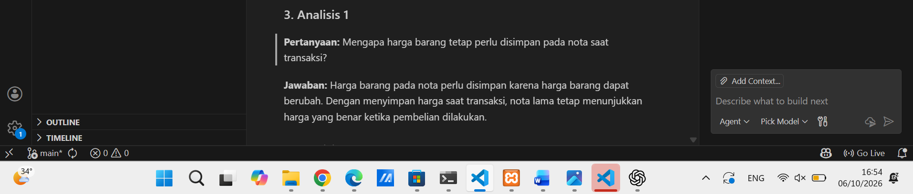
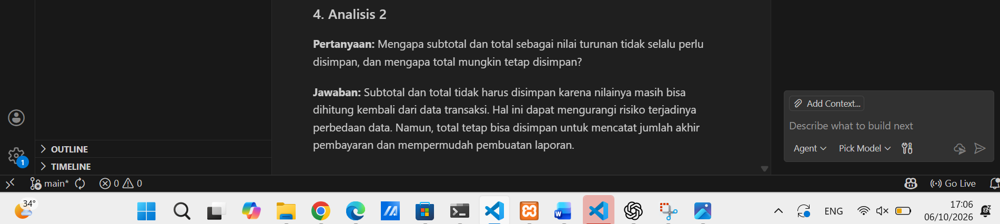
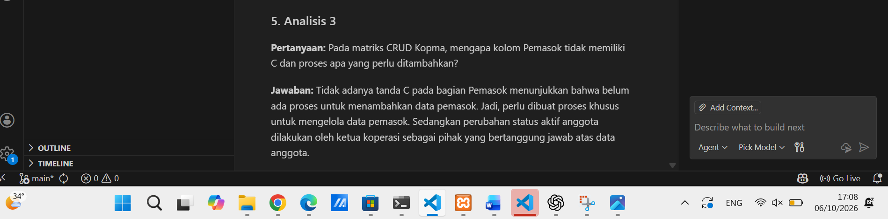
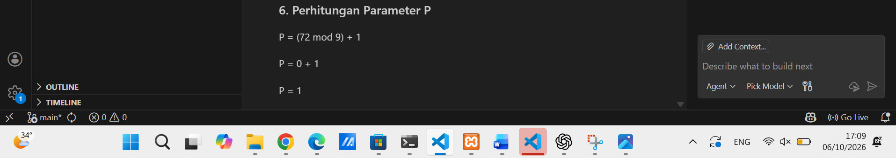
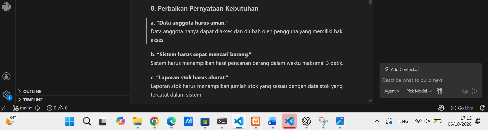
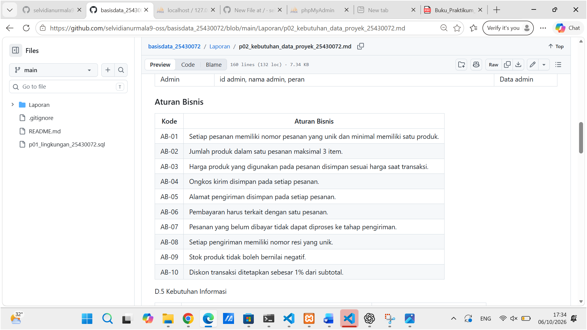
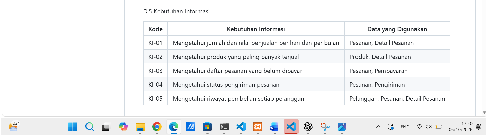
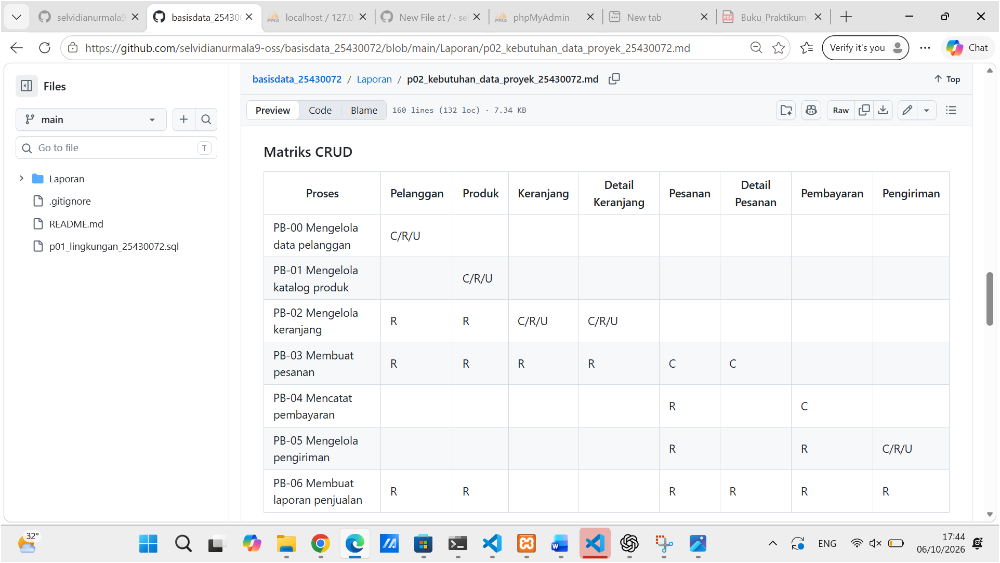
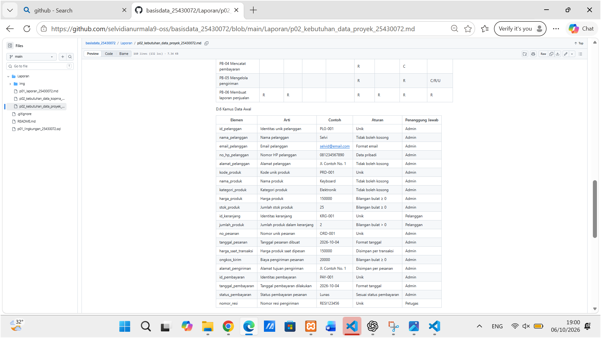

# LAPORAN PRAKTIKUM BASIS DATA

## MODUL 2: ANALISIS KEBUTUHAN PENGELOLAAN DATA

**Nama:** Selvi  
**NIM:** 25430072  
**Kelas:**  
**Mata Kuliah:** Basis Data  
**Modul:** 2  
**Tema Proyek:** Toko Daring  
**Nama Proyek/Organisasi:** Toko Serba Digital SDN  

---

# 1. TUJUAN PRAKTIKUM

Praktikum ini bertujuan untuk memahami cara menganalisis kebutuhan data dalam suatu sistem basis data. Pada praktikum ini dilakukan identifikasi proses bisnis, entitas, atribut, aturan bisnis, kebutuhan informasi, operasi CRUD, kamus data, kebutuhan nonfungsional, serta sumber data yang digunakan.

Selain itu, praktikum ini bertujuan untuk menerapkan hasil analisis tersebut pada proyek basis data dengan tema Toko Daring.

---

# 2. RINGKASAN DASAR TEORI

Analisis kebutuhan data merupakan tahap untuk menentukan data apa saja yang dibutuhkan oleh suatu sistem agar proses bisnis dapat berjalan dengan baik.

Beberapa hal yang perlu diperhatikan dalam analisis kebutuhan data antara lain:

1. **Proses Bisnis (PB)**  
   Proses bisnis merupakan kegiatan yang dilakukan oleh pengguna atau organisasi dalam menjalankan sistem.

2. **Entitas**  
   Entitas merupakan objek yang datanya perlu disimpan dalam basis data.

3. **Atribut**  
   Atribut merupakan informasi atau karakteristik yang dimiliki oleh suatu entitas.

4. **Aturan Bisnis (AB)**  
   Aturan bisnis merupakan ketentuan yang harus dipenuhi dalam pengelolaan data.

5. **Kebutuhan Informasi (KI)**  
   Kebutuhan informasi merupakan informasi yang diperlukan oleh pengguna berdasarkan data yang tersimpan.

6. **CRUD**  
   CRUD merupakan operasi dasar pada data yang terdiri dari Create, Read, Update, dan Delete.

7. **Kamus Data**  
   Kamus data digunakan untuk menjelaskan elemen data yang digunakan dalam sistem, termasuk nama, aturan, contoh, dan pihak yang bertanggung jawab.

8. **Kebutuhan Nonfungsional**  
   Kebutuhan nonfungsional menjelaskan kebutuhan sistem seperti keamanan, kapasitas penyimpanan, integritas data, dan hak akses.

---

# 3. HASIL LANGKAH PERCOBAAN

## 3.1 Titik Analisis 1

**Pertanyaan:**  
Mengapa harga barang pada nota perlu disimpan?

**Jawaban:**

Harga barang pada nota perlu disimpan karena harga barang dapat berubah. Dengan menyimpan harga saat transaksi, nota lama tetap menunjukkan harga yang benar ketika pembelian dilakukan.

**Bukti:**

---

## 3.2 Titik Analisis 2

**Pertanyaan:**  
Apakah subtotal dan total perlu disimpan?

**Jawaban:**

Subtotal dan total tidak harus disimpan karena nilainya masih bisa dihitung kembali dari data transaksi. Hal ini dapat mengurangi risiko terjadinya perbedaan data. Namun, total tetap bisa disimpan untuk mencatat jumlah akhir pembayaran dan mempermudah pembuatan laporan.

**Bukti:**

---

## 3.3 Titik Analisis 3

**Pertanyaan:**  
Apa arti tidak adanya tanda C pada bagian Pemasok?

**Jawaban:**

Tidak adanya tanda C pada bagian Pemasok menunjukkan bahwa belum ada proses untuk menambahkan data pemasok. Jadi, perlu dibuat proses khusus untuk mengelola data pemasok. Sedangkan perubahan status aktif anggota dilakukan oleh ketua koperasi sebagai pihak yang bertanggung jawab terhadap data anggota.

**Bukti:**

---

## 3.4 Perhitungan Parameter P

Parameter proyek dihitung berdasarkan dua digit terakhir NIM.

NIM = 25430072

Dua digit terakhir = 72

Rumus:

P = (72 mod 9) + 1

P = 0 + 1

P = 1

Jadi, nilai parameter **P = 1**.

**Bukti:**

---

## 3.5 Perbaikan Pernyataan Kebutuhan Kabur

### a. Pernyataan awal

Data anggota hanya dapat diakses dan diubah oleh pengguna yang memiliki hak akses.

### b. Pernyataan awal

Sistem harus menampilkan hasil pencarian barang dalam waktu maksimal 3 detik.

### c. Pernyataan awal

Laporan stok harus menampilkan jumlah stok yang sesuai dengan data stok yang tercatat dalam sistem.

**Bukti:**

---

# 4. JAWABAN TITIK ANALISIS

Hasil analisis pada praktikum menunjukkan bahwa data yang disimpan harus dapat mendukung proses bisnis dan kebutuhan informasi organisasi.

Penyimpanan harga saat transaksi diperlukan agar nilai transaksi lama tidak berubah ketika harga produk mengalami perubahan. Selain itu, beberapa data dapat dihitung kembali berdasarkan data transaksi sehingga tidak selalu harus disimpan sebagai data tersendiri.

Aturan bisnis juga diperlukan agar data yang masuk ke dalam sistem tetap sesuai dengan ketentuan. Kebutuhan informasi digunakan untuk menentukan laporan atau informasi yang dapat dihasilkan dari data yang telah disimpan.

---

# 5. HASIL LATIHAN DAN MODIFIKASI

## 5.1 Identitas Proyek

| Keterangan | Isi |
|---|---|
| Nama Proyek/Organisasi | Toko Serba Digital SDN |
| Tema | Toko Daring |
| Kode Tema | toko |
| NIM | 25430072 |
| Parameter P | 1 |

---

## 5.2 Proses Bisnis

| Kode | Proses Bisnis | Aktor | Pemicu |
|---|---|---|---|
| PB-00 | Mengelola data pelanggan | Pelanggan/Admin | Pelanggan melakukan pendaftaran atau mengubah data |
| PB-01 | Mengelola katalog produk | Admin | Ada produk baru atau perubahan informasi produk |
| PB-02 | Mengelola keranjang | Pelanggan | Pelanggan memilih produk |
| PB-03 | Membuat pesanan | Pelanggan | Pelanggan melakukan checkout |
| PB-04 | Mencatat pembayaran | Pelanggan/Admin | Pembayaran dilakukan |
| PB-05 | Mengelola pengiriman | Admin/Petugas | Pesanan sudah dibayar |
| PB-06 | Membuat laporan penjualan | Admin | Akhir periode laporan |

---

## 5.3 Data Disimpan dan Data Dihitung

### Data yang Disimpan

- Nomor pesanan
- Tanggal pesanan
- Data pelanggan
- Produk
- Jumlah produk
- Harga produk saat transaksi
- Ongkos kirim
- Alamat pengiriman
- Tanggal pembayaran

### Data yang Dihitung

- Subtotal
- Diskon
- Total pembayaran

---

## 5.4 Entitas dan Atribut

| Entitas | Atribut | Keterangan |
|---|---|---|
| Pelanggan | id pelanggan, nama, email, nomor HP, alamat | Data pelanggan |
| Produk | kode produk, nama produk, kategori, harga, stok | Katalog produk |
| Keranjang | id keranjang, pelanggan, tanggal dibuat | Data keranjang |
| Detail Keranjang | id keranjang, produk, jumlah | Data keranjang |
| Pesanan | nomor pesanan, tanggal pesanan, pelanggan, ongkos kirim, alamat pengiriman | Halaman pesanan |
| Detail Pesanan | nomor pesanan, produk, jumlah, harga saat transaksi | Halaman pesanan |
| Pembayaran | id pembayaran, nomor pesanan, tanggal pembayaran, jumlah pembayaran, status pembayaran | Bukti pembayaran |
| Pengiriman | nomor pengiriman, nomor pesanan, tanggal pengiriman, nomor resi, status pengiriman | Resi pengiriman |
| Admin | id admin, nama admin, peran | Data admin |

---

## 5.5 Aturan Bisnis

| Kode | Aturan Bisnis |
|---|---|
| AB-01 | Setiap pesanan memiliki nomor pesanan yang unik dan minimal memiliki satu produk. |
| AB-02 | Jumlah produk dalam satu pesanan maksimal 3 item. |
| AB-03 | Harga produk yang digunakan pada pesanan disimpan sesuai harga saat transaksi. |
| AB-04 | Ongkos kirim disimpan pada setiap pesanan. |
| AB-05 | Alamat pengiriman disimpan pada setiap pesanan. |
| AB-06 | Pembayaran harus terkait dengan satu pesanan. |
| AB-07 | Pesanan yang belum dibayar tidak dapat diproses ke tahap pengiriman. |
| AB-08 | Setiap pengiriman memiliki nomor resi yang unik. |
| AB-09 | Stok produk tidak boleh bernilai negatif. |
| AB-10 | Diskon transaksi ditetapkan sebesar 1% dari subtotal. |

**Bukti GitHub:**

---

## 5.6 Kebutuhan Informasi

| Kode | Kebutuhan Informasi | Sumber Data |
|---|---|---|
| KI-01 | Jumlah dan nilai penjualan per hari dan per bulan | Pesanan, Detail Pesanan |
| KI-02 | Produk paling banyak terjual | Produk, Detail Pesanan |
| KI-03 | Daftar pesanan belum dibayar | Pesanan, Pembayaran |
| KI-04 | Status pengiriman pesanan | Pesanan, Pengiriman |
| KI-05 | Riwayat pembelian setiap pelanggan | Pelanggan, Pesanan, Detail Pesanan |

**Bukti GitHub:**

---

## 5.7 Matriks CRUD

| Proses | Pelanggan | Produk | Keranjang | Detail Keranjang | Pesanan | Detail Pesanan | Pembayaran | Pengiriman |
|---|---|---|---|---|---|---|---|---|
| PB-00 | C/R/U | | | | | | | |
| PB-01 | | C/R/U | | | | | | |
| PB-02 | R | R | C/R/U | C/R/U | | | | |
| PB-03 | R | R | R | R | C | C | | |
| PB-04 | | | | | R | | C | |
| PB-05 | | | | | R | | R | C/R/U |
| PB-06 | R | R | | | R | R | R | R |

**Bukti GitHub:**

---

## 5.8 Kamus Data

| No | Nama Data | Contoh | Aturan | Penanggung Jawab |
|---|---|---|---|---|
| 1 | id_pelanggan | PLG001 | Unik dan tidak boleh kosong | Admin |
| 2 | nama_pelanggan | Selvi | Tidak boleh kosong | Pelanggan |
| 3 | email_pelanggan | selvi@email.com | Format email valid | Pelanggan |
| 4 | no_hp_pelanggan | 081234567890 | Nomor telepon valid | Pelanggan |
| 5 | alamat_pelanggan | Jl. Contoh No. 1 | Tidak boleh kosong | Pelanggan |
| 6 | kode_produk | PRD001 | Unik | Admin |
| 7 | nama_produk | Keyboard | Tidak boleh kosong | Admin |
| 8 | kategori_produk | Aksesoris | Tidak boleh kosong | Admin |
| 9 | harga_produk | 150000 | Nilai tidak boleh negatif | Admin |
| 10 | stok_produk | 20 | Tidak boleh negatif | Admin |
| 11 | id_keranjang | KRT001 | Unik | Pelanggan |
| 12 | jumlah_produk | 2 | Minimal 1 | Pelanggan |
| 13 | no_pesanan | ORD-001 | Unik | Sistem |
| 14 | tanggal_pesanan | 2026-10-04 | Format tanggal valid | Sistem |
| 15 | harga_saat_transaksi | 150000 | Disimpan sesuai harga transaksi | Sistem |
| 16 | ongkos_kirim | 20000 | Tidak boleh negatif | Admin |
| 17 | alamat_pengiriman | Jl. Contoh No. 1 | Tidak boleh kosong | Pelanggan |
| 18 | id_pembayaran | PAY001 | Unik | Admin |
| 19 | tanggal_pembayaran | 2026-10-04 | Format tanggal valid | Sistem |
| 20 | status_pembayaran | Lunas | Mengikuti status pembayaran | Admin |
| 21 | nomor_resi | RESI001 | Unik | Petugas |

**Bukti GitHub:**

---

## 5.9 Kebutuhan Nonfungsional

### Volume Data

Sistem diperkirakan menangani sekitar 45 transaksi per hari.

### Penyimpanan

Data pesanan, pembayaran, dan pengiriman disimpan minimal selama 5 tahun.

### Kerahasiaan Data

Data pribadi pelanggan seperti nama, email, nomor HP, dan alamat harus dijaga kerahasiaannya.

### Hak Akses

Data hanya dapat diakses atau diubah oleh pengguna yang memiliki hak akses, terutama admin yang bertanggung jawab terhadap pengelolaan data.

### Integritas Data

Nomor pesanan, kode produk, dan nomor resi harus bersifat unik dan tidak boleh kosong.

### Keamanan

Sistem harus mencegah perubahan data dan akses yang dilakukan oleh pengguna yang tidak memiliki hak akses.

---

## 5.10 Permasalahan Kualitas Data

Beberapa permasalahan kualitas data yang dapat terjadi antara lain:

1. Data pelanggan tidak lengkap.
2. Harga atau stok produk tidak sesuai.
3. Nomor pesanan atau nomor resi mengalami duplikasi.
4. Alamat pengiriman tidak lengkap.
5. Jumlah pembayaran tidak sesuai dengan total pesanan.
6. Jumlah produk yang salah dapat menyebabkan ketidaksesuaian stok.

---

## 5.11 Sumber Data Fiktif

**Nama sumber:** Halaman Pesanan Toko Serba Digital SDN

Contoh data:

| Data | Nilai |
|---|---|
| Nomor Pesanan | ORD-001 |
| Tanggal Pesanan | 2026-10-04 |
| Pelanggan | Selvi |
| Produk | Keyboard |
| Jumlah | 2 |
| Harga Saat Transaksi | 150000 |
| Ongkos Kirim | 20000 |
| Alamat Pengiriman | Jl. Contoh No. 1 |
| Status Pembayaran | Lunas |

### Analisis Sumber Data

Berdasarkan sumber data tersebut, sistem perlu menyimpan nomor pesanan, tanggal pesanan, data pelanggan, produk, jumlah produk, harga produk saat transaksi, ongkos kirim, alamat pengiriman, dan status pembayaran.

Subtotal dan total pembayaran dapat dihitung berdasarkan data transaksi.

---

# 6. TUGAS MANDIRI: MILESTONE PROYEK 2

Pada milestone proyek 2 dilakukan analisis kebutuhan data untuk proyek **Toko Serba Digital SDN** dengan tema **Toko Daring**.

Analisis dilakukan dengan menentukan proses bisnis, entitas, aturan bisnis, kebutuhan informasi, matriks CRUD, kamus data, kebutuhan nonfungsional, permasalahan kualitas data, serta sumber data fiktif.

File proyek yang digunakan adalah:

`Laporan/p02_kebutuhan_data_proyek_25430072.md`

Hasil analisis tersebut menjadi dasar untuk tahap pengembangan basis data pada tahap berikutnya.

---

# 7. PEMBAHASAN DAN KENDALA

## 7.1 Pembahasan

Pada praktikum ini dilakukan analisis kebutuhan data untuk sistem Toko Serba Digital SDN. Analisis dimulai dengan menentukan proses bisnis yang terdapat pada sistem toko daring.

Selanjutnya ditentukan entitas dan atribut yang diperlukan untuk menyimpan data. Aturan bisnis dibuat agar data yang disimpan tetap sesuai dengan ketentuan sistem.

Matriks CRUD digunakan untuk mengetahui operasi data yang dilakukan pada setiap proses bisnis. Kamus data digunakan untuk memberikan penjelasan lebih rinci mengenai elemen data yang digunakan.

Selain itu, kebutuhan nonfungsional juga ditentukan untuk memperhatikan aspek keamanan, hak akses, penyimpanan, dan integritas data.

## 7.2 Kendala

Kendala yang ditemukan dalam praktikum adalah memastikan setiap proses bisnis memiliki data yang sesuai serta memastikan hubungan antara proses bisnis, entitas, aturan bisnis, kebutuhan informasi, dan operasi CRUD tetap konsisten.

---

# 8. KESIMPULAN

Berdasarkan praktikum yang telah dilakukan, dapat disimpulkan bahwa analisis kebutuhan data merupakan tahap penting dalam perancangan basis data.

Melalui analisis proses bisnis, entitas, atribut, aturan bisnis, kebutuhan informasi, CRUD, kamus data, dan kebutuhan nonfungsional, kebutuhan data dalam sistem dapat diketahui dengan lebih jelas.

Pada proyek Toko Serba Digital SDN, hasil analisis digunakan sebagai dasar untuk pengembangan basis data dengan tema Toko Daring.

---

# 9. PERNYATAAN PENGGUNAAN AI

Dalam penyusunan laporan ini, AI digunakan sebagai alat bantu untuk membantu memahami materi, menyusun kalimat, dan merapikan penulisan. Isi laporan tetap disesuaikan dengan hasil praktikum dan kebutuhan proyek yang dikerjakan.

---

# 10. BUKTI GIT

File proyek telah disusun pada repository GitHub dengan struktur file:

`Laporan/p02_kebutuhan_data_proyek_25430072.md`

Bukti GitHub digunakan untuk menunjukkan hasil tabel proses bisnis, aturan bisnis, kebutuhan informasi, matriks CRUD, dan kamus data.

---

# CHECKLIST

- [x] Berkas `p02_kebutuhan_data_kopma_25430072.md`
- [x] Berkas `p02_kebutuhan_data_proyek_25430072.md`
- [x] Bukti Titik Analisis 1
- [x] Bukti Titik Analisis 2
- [x] Bukti Titik Analisis 3
- [x] Bukti perhitungan parameter P
- [x] Bukti perbaikan tiga pernyataan kebutuhan kabur
- [x] Tabel Proses Bisnis (PB)
- [x] Tabel Aturan Bisnis (AB)
- [x] Tabel Kebutuhan Informasi (KI)
- [x] Matriks CRUD
- [x] Kamus Data minimal 20 elemen
- [x] Kebutuhan Nonfungsional
- [x] Permasalahan kualitas data
- [x] Sumber data fiktif dan analisisnya
- [x] Analisis keaslian: nama organisasi, dokumen sumber fiktif, dan parameter P bersifat personal
- [x] Laporan sudah di-commit dan di-push sebelum batas waktu